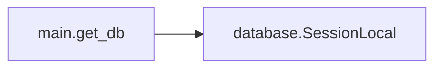
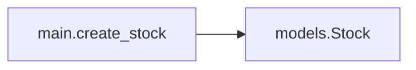
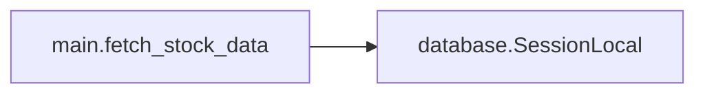

# Key Objects

[_Documentation generated by Documatic_](https://www.documatic.com)

<!---Documatic-section-main.get_db-start--->
## main.get_db

<!---Documatic-section-get_db-start--->


### Object Calls

* database.SessionLocal

<!---Documatic-block-main.get_db-start--->
<details>
	<summary><code>main.get_db</code> code snippet</summary>

```python
def get_db():
    try:
        db = SessionLocal()
        yield db
    finally:
        db.close()
```
</details>
<!---Documatic-block-main.get_db-end--->
<!---Documatic-section-get_db-end--->

# #
<!---Documatic-section-main.get_db-end--->

<!---Documatic-section-main.create_stock-start--->
## main.create_stock

<!---Documatic-section-create_stock-start--->


### Object Calls

* models.Stock

<!---Documatic-block-main.create_stock-start--->
<details>
	<summary><code>main.create_stock</code> code snippet</summary>

```python
@app.post('/stock')
async def create_stock(stock_request: StockRequest, background_tasks: BackgroundTasks, db: Session=Depends(get_db)):
    stock = Stock()
    stock.symbol = stock_request.symbol
    db.add(stock)
    db.commit()
    background_tasks.add_task(fetch_stock_data, stock.id)
    return {'code': 'success', 'message': 'stock was added to the database'}
```
</details>
<!---Documatic-block-main.create_stock-end--->
<!---Documatic-section-create_stock-end--->

# #
<!---Documatic-section-main.create_stock-end--->

<!---Documatic-section-main.fetch_stock_data-start--->
## main.fetch_stock_data

<!---Documatic-section-fetch_stock_data-start--->


### Object Calls

* database.SessionLocal

<!---Documatic-block-main.fetch_stock_data-start--->
<details>
	<summary><code>main.fetch_stock_data</code> code snippet</summary>

```python
def fetch_stock_data(id: int):
    db = SessionLocal()
    stock = db.query(Stock).filter(Stock.id == id).first()
    yahoo_data = yfinance.Ticker(stock.symbol)
    stock.ma200 = yahoo_data.info['twoHundredDayAverage']
    stock.ma50 = yahoo_data.info['fiftyDayAverage']
    stock.price = yahoo_data.info['previousClose']
    stock.forward_pe = yahoo_data.info['forwardPE']
    stock.forward_eps = yahoo_data.info['forwardEps']
    stock.dividend_yield = yahoo_data.info['dividendYield'] * 100
    db.add(stock)
    db.commit()
```
</details>
<!---Documatic-block-main.fetch_stock_data-end--->
<!---Documatic-section-fetch_stock_data-end--->

# #
<!---Documatic-section-main.fetch_stock_data-end--->

<!---Documatic-section-main.home-start--->
## main.home

<!---Documatic-section-home-start--->
<!---Documatic-block-main.home-start--->
<details>
	<summary><code>main.home</code> code snippet</summary>

```python
@app.get('/')
def home(request: Request, forward_pe=None, dividend_yield=None, ma50=None, ma200=None, db: Session=Depends(get_db)):
    stocks = db.query(Stock)
    if forward_pe:
        stocks = stocks.filter(Stock.forward_pe < forward_pe)
    if dividend_yield:
        stocks = stocks.filter(Stock.dividend_yield > dividend_yield)
    if ma50:
        stocks = stocks.filter(Stock.price > Stock.ma50)
    if ma200:
        stocks = stocks.filter(Stock.price > Stock.ma200)
    stocks = stocks.all()
    return templates.TemplateResponse('home.html', {'request': request, 'stocks': stocks, 'dividend_yield': dividend_yield, 'forward_pe': forward_pe, 'ma200': ma200, 'ma50': ma50})
```
</details>
<!---Documatic-block-main.home-end--->
<!---Documatic-section-home-end--->

# #
<!---Documatic-section-main.home-end--->

[_Documentation generated by Documatic_](https://www.documatic.com)